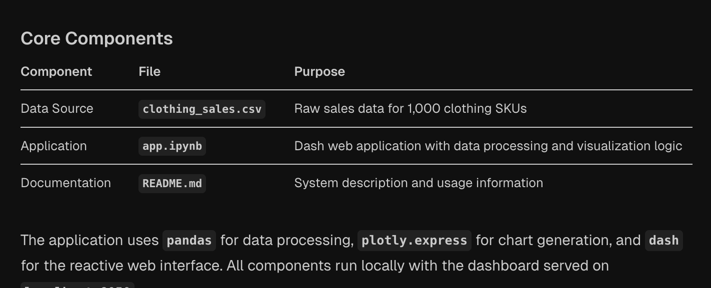
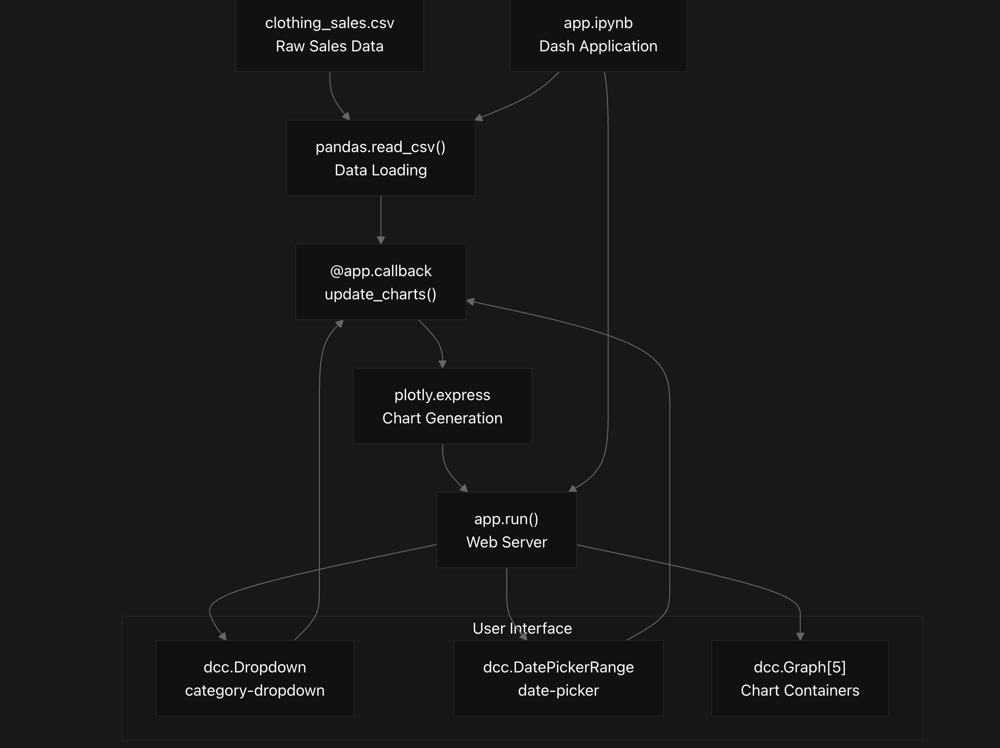
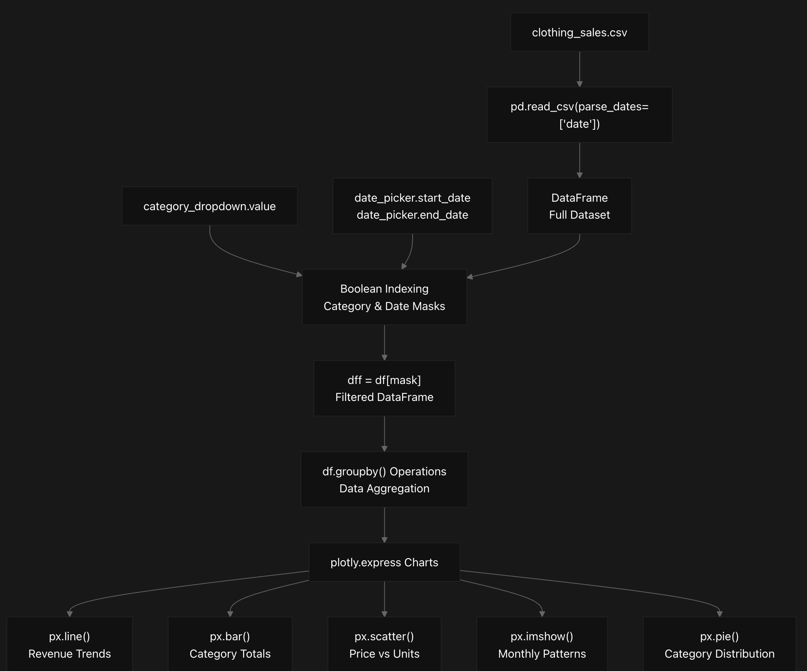
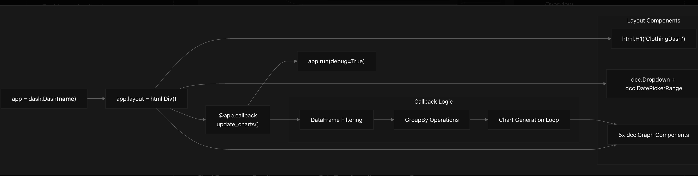
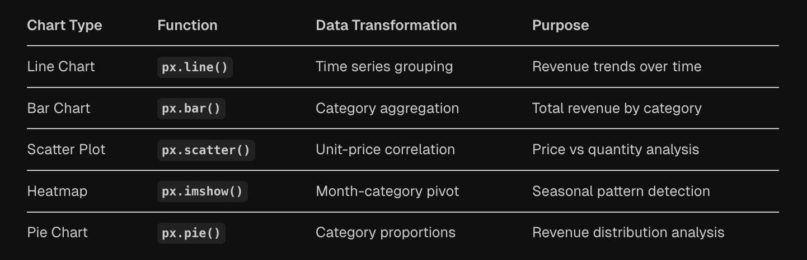
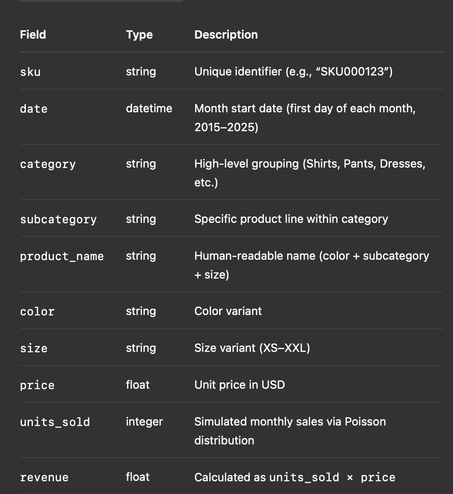

# ClothingDash
## ClothingDash Overview
This document provides a high-level introduction to ClothingDash, a Plotly Dash web application that creates interactive analytics dashboards for clothing sales data. ClothingDash processes synthetic sales data for 1,000 clothing SKUs and presents five different visualization types through a reactive web interface.

## System Architecture
ClothingDash follows a simple three-component architecture where a CSV data source feeds into a Jupyter notebook-based Dash application that generates interactive web visualizations.

## Core Components

## High-Level System Flow

This diagram shows how the clothing_sales.csv file flows through pandas.read_csv() into the main callback function update_charts(), which processes user inputs from dcc.Dropdown and dcc.DatePickerRange components to generate charts via plotly.express and serve them through the app.run() web server.Data 

## Processing Pipeline
ClothingDash implements a reactive data processing pipeline where user filter selections trigger data transformations and chart regeneration across all visualization types simultaneously.

The pipeline begins with pd.read_csv() loading the CSV data with date parsing. User interactions with category_dropdown.value and date picker components trigger boolean indexing operations that create a filtered DataFrame (dff). This filtered data undergoes groupby() aggregation before being passed to individual plotly.express chart generation functions.

## Application Structure
The app.ipynb file contains the complete Dash application implementation using a single-file architecture pattern common in data science workflows.

### Core Application Components

## Visualization Types
ClothingDash generates five distinct chart types from the same filtered dataset, providing multiple analytical perspectives on clothing sales patterns.

Each chart type uses different groupby() operations and aggregation functions on the filtered DataFrame (dff) to create specialized views of the sales data. The reactive callback system ensures all five charts update simultaneously when filter values change.

## Clothing Sales Dataset & Dashboard Creation

### Dataset Generation Overview

This document outlines the creation of a synthetic clothing sales dataset and the interactive Plotly Dash application built atop it. The data simulates monthly sales for 1,000 unique SKUs over a 10-year period, each annotated with detailed product attributes and revenue calculations.

#### Data Source & Schema

#### Dataset Creation Pipeline
    1.	Attribute Sampling
    •	1,000 SKUs generated as zero-padded identifiers.
    •	Categories assigned randomly from a predefined list; subcategories, colors, sizes, and prices sampled accordingly.
    2.	Temporal Expansion
    •	Monthly index created spanning May 2015 through April 2025 (120 periods).
    •	Cartesian product of SKUs × months yields 120,000 rows.
    3.	Sales Simulation & Revenue
    •	Poisson distributions parameterized per category model units sold.
    •	Revenue computed per row, rounded to two decimal places.
    4.	Output
    •	Final CSV exports:
    •	clothing_sales_10yr.csv (no product name)
    •	clothing_sales_10yr_with_name.csv (includes product_name column)

#### Prompting & Interactive Dashboard
    •	Prompt Sequence
    •	Initial request: synthetic 2-year dataset for 1,000 SKUs.
    •	Extended to 10 years with monthly granularity.
    •	Added product_name column on user demand.
    •	Iterative code provisioning for a Plotly Dash app.
    •	Adjustments for visual appeal and 3D charts as per feedback.
    •	Dash Application Structure
    •	Entry point: app.py (or app.ipynb with JupyterDash).
    •	Layout: Dropdown for categories + DatePickerRange for time span.
    •	Callbacks: Single @app.callback handles all filter inputs and regenerates five charts.
•	Visualization Types:
1.	Line Chart – Revenue over time by category
2.	Bar Chart – Total revenue per category
3.	Scatter Plot – Price vs. units sold (with optional 3D variant)
4.	Heatmap – Monthly revenue intensity by category
5.	Pie Chart – Revenue distribution by category
